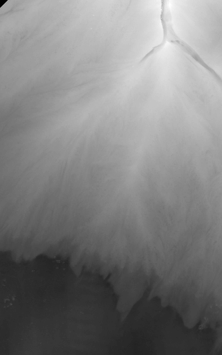

# channel_image_segmentation

This is a collabrative repositary hosting code to identify channel pixels from a flume experiment image, with optionally additional data like elevation maps. 

## data

Example data sets are provided in `data/test_data`. The images in the folder are in groups of three: one correspond to the mask (target for the model), one correspond to the RGB image, and another one correspond to the elevation model (optional data). For example:




The module ``data_preparing`` provides methods to generate the groups of images from a data source like ``numpy.ndarray`` or matlab's ``.mat`` files.

## requirements

### Python 3

The [The Hitchhiker’s Guide to Python](https://docs.python-guide.org/) contains 
detailed instructions on how to setup python and virtualenv (recommended). Please follow it to install Python 3.

### modules

We recommend using virtual environments to isolate the program environment. The file `requirements.txt` contains a list of module needed for the project. To setup an environment using ``python3-venv`` on Windows:

```terminal
cd \path\to\repo
python -m venv .venv
.venv\Scripts\activate
pip install -r requirements.txt
```

On Linux/MacOS:

```bash
cd /path/to/repo
python3 -m venv .venv
source .venv/bin/active
pip3 install -r requirements.txt
```

This project uses [Tensorflow](https://www.tensorflow.org/) to construct the CNN models. 

GPU or better resource is recommended to train the model. One could experiment or demo with a small sample dataset on a CPU only environment.

## Run example model scripts

The repository includes an example unet model. The model loads data from specified path as ChannelData objects and feeds them into the model pipeline. The model script is `utils/run_unet.py`. To use it please follow the steps below:

- ensure a tensorflow environment is activated (see section above for more information)
- set the path to the train and vali datasets in lines 29 to 36 where `train_data` and `val_data` objects are defined.
- set the false positive loss weight at line 25: if `fp_weight` < 1, the model tolerates false positive more than false negative; this can lead to a model segmenting more channels than training masks but potentially pick up subtle channels beyond human interpretation
- set model building mode at line 19 to either a learning rate finding mode (`find_lr = True`) or model training mode (`find_lr = False`); by default the model uses a scheduler to change learning rate from `1e-3` to `1e4` (lines 81 to 86)
- execute `python run_unet.py` on Windows or `python3 run_unet.py` on Linux/Mac to start model training/learning rate finding